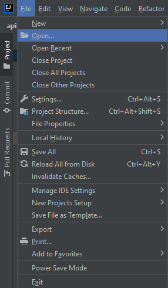
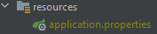
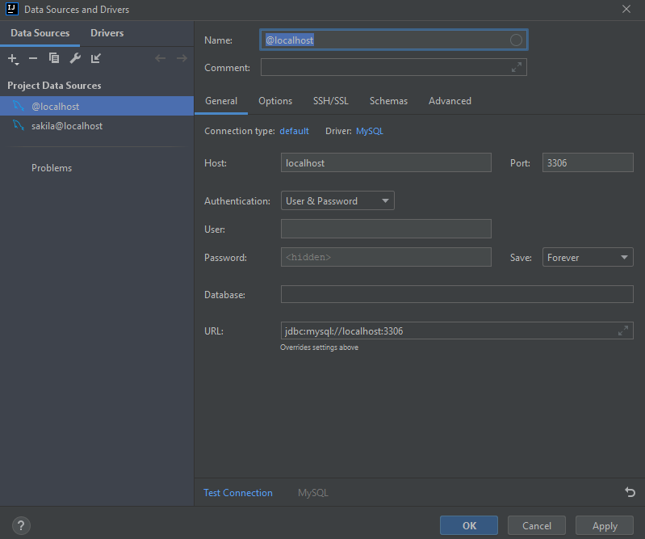
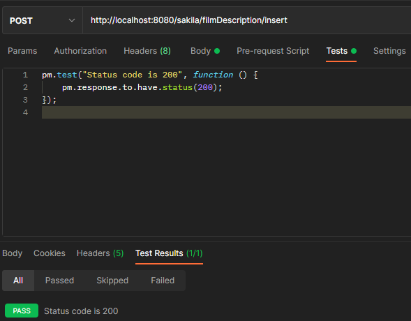
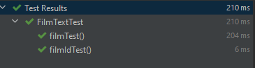
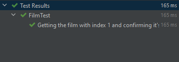

# API Project (Team 2) Week 6 

## Table of Content
1. [About the Project](#About-the-Project)
2. [Problems](#Problems)
3. [Getting Started](#Getting-Started)
4. [Testing in Postman](#Testing-in-Postman)
5. [Testing in JUnit](#Testing-in-JUnit)

### About the Project

We are creating a basic API system that is able to perform basic functions to the Sakila database that has been provided
to us. We are using different HTTP methods to do things with the data we have in the database. These are GET, POST, PUT,
DELETE and PATCH.

#### Problems

During the project, the team started to run into problems quite quickly where there are 
many error when trying to delete data. There are tables that linked to other tables which has 
foreign key constraints. 

During the testing there are different errors where the test would work on one person machine in the team but not for another
and there would also be tests that would pass and not pass depending on how you ran the test. DELETE method was probably the 
hardest one to get working.

### Getting Started
This will help you get started getting our project on your system.

1. Clone the repository using Git Bash or Console - using git clone with the URL below.

```https://github.com/alexsusanu/apiProject.git```

2. Open your project from within your coding editor (in this case, this is done through Intellij).
   
3. Once you have the project opened, you need to add a "application.properties" file under recoures
   
4. Once you have created your "applications.properties" file you will need to include the follow code.
```
spring.datasource.url=jdbc:mysql://localhost:3306/sakila
spring.datasource.username=(username for your localhost MySql)
spring.datasource.password=(password for your localhost MySql)
spring.jackson.serialization.fail-on-empty-beans=false
```
5. To access the database you need to click on the tab on the right called Database and select
the "+" icon. Select Data Source -> MySQL -> a popup will appear (shown below)

6. Add the user and password. After that is done test the connection which is on the bottom left of the
popup.
7. You are ready to run the application.
### Testing in Postman

**Inserting Data**

Here is a simple method to show that the data bas been correctly inserted into the database which shows the pass result
as part of the test.



### Testing in JUnit

Here are some JUnit test of the methods that we created.

**Getting a FilmText with film title**
```Java
@Test
public void filmTest() throws IOException {
    ObjectMapper mapper = new ObjectMapper();
    mapper.disable(DeserializationFeature.FAIL_ON_UNKNOWN_PROPERTIES);
    mapper.setVisibility(VisibilityChecker.Std.defaultInstance().withFieldVisibility(JsonAutoDetect.Visibility.ANY));
    FilmText film = mapper.readValue(new URL("http://localhost:8080/sakila/filmDescription?id=1300"), FilmText.class);
    assertEquals("INTERSTELLAR", film.getTitle());
}
```


**Getting the film with index 1 and confirming it's name**
```Java
@Test
@DisplayName("Getting the film with index 1 and confirming it's name")
public void getFilm(){
    try {
        Film film = mapper.readValue(new URL("http://localhost:8080/sakila/film?id=1"), Film.class);
        assert(film.getTitle().equals("ACADEMY DINOSAUR"));
    } catch (IOException e) {
        e.printStackTrace();
    }
}
```
